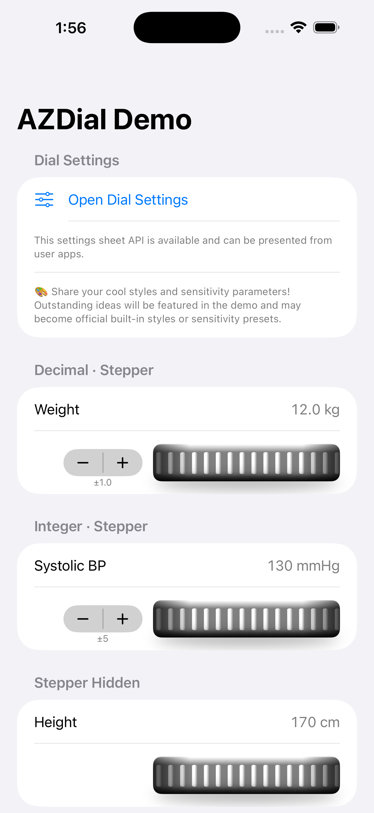
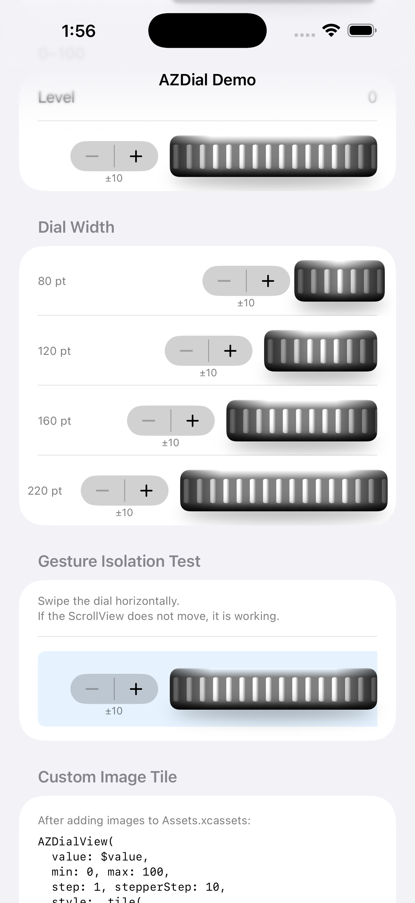
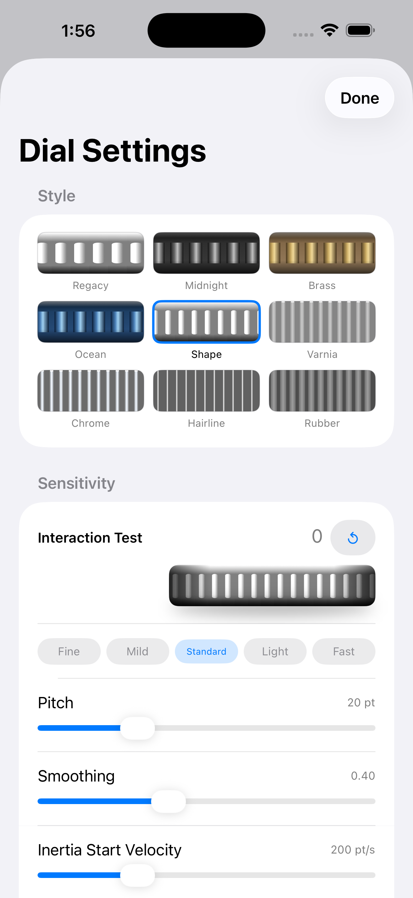

# AZDial

A SwiftUI scroll-wheel dial control for iOS and macOS.

Originally created as an Objective-C component in 2012. Rewritten in SwiftUI in 2025.


**Documentation:** [English](https://docs.azukid.com/en/sumpo/AZDial/azdial.html) · [日本語](https://docs.azukid.com/jp/sumpo/AZDial/azdial.html)

---

## Demo

<p>
  
  &nbsp;
  
  &nbsp;
  
</p>

---

## Features

- 9 built-in visual styles + custom image tile support
- Adjustable dial width (80–220 pt)
- Optional stepper buttons with decimal label
- Velocity-sensitive drag with inertia (flick to coast)
- Step-snapping drag — no visual jump on finger lift
- Navigation swipe-back blocking during dial interaction (iOS)
- Haptic feedback on every step (iOS)
- `AZDialInteractionTuning` — fully tunable interaction parameters
- `AZDialSettingsView` — ready-made settings sheet for style and sensitivity
- VoiceOver / Accessibility support
- Dark mode support
- Pure SwiftUI — no UIKit wrappers required in your code

## Requirements

- iOS 16.0+ / macOS 13.0+
- Swift 5.9+
- Xcode 15+

## Installation

### Swift Package Manager

In Xcode: **File → Add Package Dependencies**

```
https://github.com/SumPositive/AZDial
```

Or add to your `Package.swift`:

```swift
dependencies: [
    .package(url: "https://github.com/SumPositive/AZDial", from: "3.0.0")
]
```

## Usage

```swift
import AZDial

struct ContentView: View {
    @State private var weight = 600  // 60.0 kg (stored ×10)

    var body: some View {
        AZDialView(
            value: $weight,
            min: 300,         // 30.0 kg
            max: 2000,        // 200.0 kg
            step: 1,
            stepperStep: 10,
            decimals: 1,
            style: .shape,
            dialWidth: 220
        )
    }
}
```

### Parameters

| Parameter | Type | Default | Description |
|---|---|---|---|
| `value` | `Binding<Int>` | — | Current value |
| `min` | `Int` | — | Minimum value |
| `max` | `Int` | — | Maximum value |
| `step` | `Int` | — | Value increment per drag step |
| `stepperStep` | `Int` | — | Stepper button increment (`0` = hidden) |
| `decimals` | `Int` | `0` | Decimal places shown on stepper label |
| `style` | `DialStyle` | `.shape` | Visual style |
| `dialWidth` | `CGFloat` | `220` | Dial width in points (clamped to 80–220) |
| `tuning` | `AZDialInteractionTuning?` | `nil` (= `.default`) | Interaction tuning; overrides `pitch` when set |
| `pitch` | `CGFloat` | `20` | Shorthand for `tuning.pitch` when `tuning` is `nil` |

---

## DialStyle

### Built-in styles

| Style | Description |
|---|---|
| `.regacy` | Classic AZDial knurling — original Objective-C design |
| `.midnight` | Dark gunmetal with high-contrast silver highlights |
| `.brass` | Warm brass with champagne gold highlights |
| `.ocean` | Blue anodized aluminum with ice-blue highlights |
| `.shape` | Shape-based knurling tile **(default)** |
| `.varnia` | Narrow machined knurling |
| `.chrome` | Polished chrome with high contrast |
| `.hairline` | Ultra-fine hairline engraving |
| `.rubber` | Wide matte rubber grip |

```swift
AZDialView(value: $value, min: 0, max: 100, step: 1, stepperStep: 10,
           style: .shape)
```

### Custom image tile

Supply your own PDF or PNG image from `Assets.xcassets`:

```swift
AZDialView(
    value: $value,
    min: 0, max: 100,
    step: 1, stepperStep: 10,
    style: .tile(
        light: "MyDialTile",
        dark: "MyDialTile_Dark",  // optional
        tileWidth: 20             // must match image width in points
    )
)
```

For assets in your own Swift Package, pass `bundle: .module`:

```swift
style: .tile(light: "MyDialTile", tileWidth: 20, bundle: .module)
```

### Persistence

Use `DialStyle.id` (a `String`) to store the selected style in UserDefaults or iCloud KVS, and restore it with `DialStyle.builtin(id:)`:

```swift
// Save
UserDefaults.standard.set(style.id, forKey: "dialStyle")

// Restore
let id = UserDefaults.standard.string(forKey: "dialStyle") ?? ""
let style = DialStyle.builtin(id: id) ?? .shape
```

---

## Interaction Tuning

`AZDialInteractionTuning` controls all drag and inertia parameters. Pass it via the `tuning` argument of `AZDialView`.

```swift
@State private var tuning = AZDialInteractionTuning.default

AZDialView(value: $value, min: 0, max: 100, step: 1, stepperStep: 10,
           tuning: tuning)
```

### Parameters

| Property | Type | Default | Description |
|---|---|---|---|
| `pitch` | `CGFloat` | `20` | Points of horizontal drag per value step |
| `velocitySmoothing` | `CGFloat` | `0.4` | Weight of the newest velocity sample (0–1) |
| `inertiaStartVelocity` | `CGFloat` | `200` | Minimum velocity (pt/s) to start inertia after lift |
| `fastSwipeVelocity` | `CGFloat` | `1500` | Velocity boundary between slow and fast multiplier |
| `slowSwipeMultiplier` | `Int` | `10` | Steps per pitch during slow inertia |
| `fastSwipeMultiplier` | `Int` | `100` | Steps per pitch during fast inertia |
| `inertiaDecay` | `CGFloat` | `0.94` | Per-frame velocity multiplier during coast (0.80–0.99) |
| `inertiaStopVelocity` | `CGFloat` | `15` | Velocity at which inertia stops |

### Built-in presets

| Preset | `pitch` | Multipliers | Feel |
|---|---|---|---|
| `.fine` | 36 pt | ×3 / ×20 | Maximum precision, minimal inertia |
| `.mild` | 28 pt | ×6 / ×50 | Controlled |
| `.standard` | 20 pt | ×10 / ×100 | **Default** |
| `.light` | 14 pt | ×15 / ×130 | Nimble |
| `.fast` | 9 pt | ×20 / ×180 | High-speed entry |

```swift
tuning = AZDialInteractionTuningPreset.fine.tuning
```

---

## AZDialSettingsView

A ready-made settings sheet for choosing a dial style and interaction sensitivity.
Present it from your app's settings screen and persist the bindings however you prefer.

```swift
@State private var style   = DialStyle.shape
@State private var tuning  = AZDialInteractionTuning.default
@State private var showSettings = false

Button("Dial Settings") { showSettings = true }
    .sheet(isPresented: $showSettings) {
        AZDialSettingsView(tuning: $tuning, style: $style)
    }
```

The sheet exposes a live-preview dial, preset buttons, and fine-grained sliders.
Customize it with `AZDialSettingsConfiguration`:

```swift
let config = AZDialSettingsConfiguration(
    title: "Input Wheel",
    styleCandidates: [.shape, .chrome, .rubber],
    testRange: 0...999
)
AZDialSettingsView(tuning: $tuning, style: $style, configuration: config)
```

### Persistence

`AZDialInteractionTuning` is `Codable`, so you can round-trip it through `UserDefaults` or `iCloud KVS`:

```swift
// Save
if let data = try? JSONEncoder().encode(tuning) {
    UserDefaults.standard.set(data, forKey: "dialTuning")
}

// Restore
if let data = UserDefaults.standard.data(forKey: "dialTuning"),
   let saved = try? JSONDecoder().decode(AZDialInteractionTuning.self, from: data) {
    tuning = saved
}
```

---

## AZDialSurface (surface only)

Use `AZDialSurface` if you need only the scrolling ridge background — for example, in a settings UI preview:

```swift
AZDialSurface(offset: 0, tickGap: 10, style: .brass)
    .frame(height: 44)
    .clipShape(RoundedRectangle(cornerRadius: 8))
```

---

## Development

Open `AZDial.xcworkspace` (not the package directly) to work on both the library and the demo app together.

```
AZDial/
├── AZDial.xcworkspace          ← open this
├── Package.swift
├── Sources/AZDial/
│   ├── AZDialView.swift
│   └── Resources/Assets.xcassets/
├── Tests/AZDialTests/
└── Examples/AZDialDemo/
```

## Contributing Styles

🎨 **Cool design proposals welcome!**

If you create an original tile image for AZDial, please share it via Issues or Pull Requests.
Outstanding designs will be showcased in the demo app and may be adopted as official built-in styles.

## License

MIT License. See [LICENSE](LICENSE) for details.
